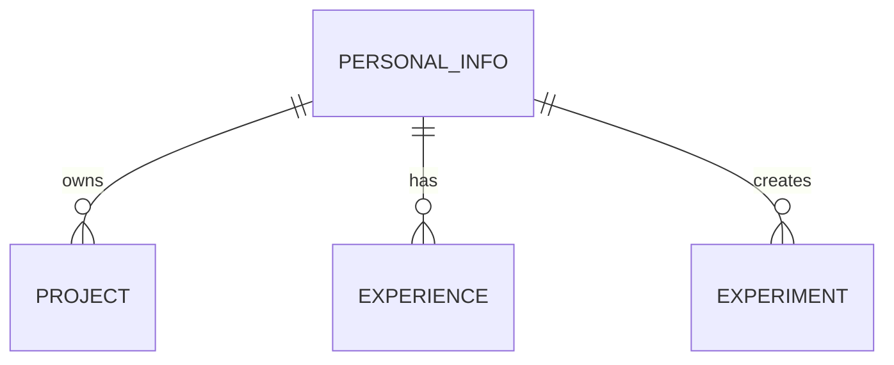

# Database Schema Documentation

This document describes the data structure of the coDY Portfolio, formatted as a logical schema for future database migration (e.g., Firestore, PostgreSQL).

## Entities

### 1. Projects
`Collection: projects`

| Field | Type | Description |
| :--- | :--- | :--- |
| id | String (PK) | Unique identifier |
| title | String | Name of the project |
| tagline | String | Short catchphrase |
| description | Text | Detailed summary |
| category | String | enum: AI, Web, Data, Security |
| tech | Array<String> | Technologies used |
| image | URL | Link to preview image |
| link | URL | Link to repository/demo |
| color | String | Visual accent (bauhaus-*) |

### 2. Experience
`Collection: experience`

| Field | Type | Description |
| :--- | :--- | :--- |
| company | String | Organization name |
| role | String | Position held |
| period | String | Date range (e.g., "JAN 2026 — PRESENT") |
| description | Text | Key responsibilities and achievements |
| color | String | Visual accent |

### 3. Experiments (Playground)
`Collection: experiments`

| Field | Type | Description |
| :--- | :--- | :--- |
| id | String (PK) | Unique identifier |
| title | String | Experiment name |
| description | String | Brief summary |
| date | String | Status (ACTIVE, ONGOING, BETA) |

### 4. Personal Info
`Document: config/personal_info`

| Field | Type | Description |
| :--- | :--- | :--- |
| fullName | String | Legal name |
| nickname | String | Display name |
| birthday | Date | Date of birth |
| location | String | Current city |
| education | String | University/Major |
| languages | Array<String> | Spoken/Written proficiencies |
| email | String | Primary contact |
| profileImage | String | Path to image |
| socials | Map<String, URL>| Social media links (Github, LinkedIn, etc.) |

## Relationship Diagram (Logical)

