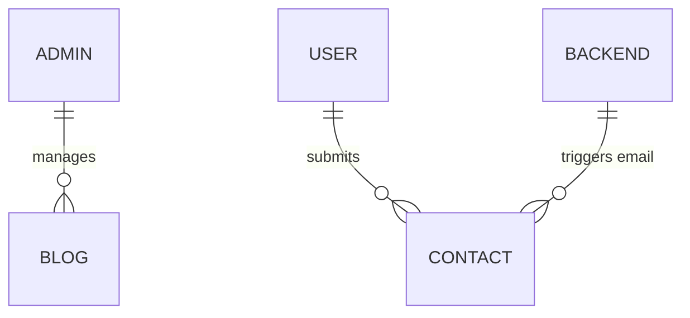

# Database Schema Documentation

This document describes the data structure of the coDY Portfolio, including local constants and Firebase Firestore collections.

## Local SSoT (src/constants.ts)
Static data used for high-performance rendering of the primary portfolio structure.

### 1. Projects
| Field | Type | Description |
| :--- | :--- | :--- |
| id | String | Unique identifier |
| title | String | Name of the project |
| tagline | String | Short catchphrase |
| description | Text | Detailed summary |
| category | String | enum: AI, Web, Data, Security |
| color | String | Visual accent (bauhaus-*) |

### 2. Experience
| Field | Type | Description |
| :--- | :--- | :--- |
| company | String | Organization name |
| role | String | Position held |
| period | String | Date range |

## Firestore Collections (Dynamic)
Managed via `firebase-blueprint.json` and secured by `firestore.rules`.

### 1. Contacts
`Collection: contacts`
*Stores incoming inquiries from the Contact page.*

| Field | Type | Description |
| :--- | :--- | :--- |
| name | String | Sender's full name |
| email | String | Sender's contact email |
| subject | String | inquiry type label |
| message | Text | Content of the inquiry |
| timestamp | ServerTimestamp | Automated creation date |

### 2. Blogs
`Collection: blogs`
*Dynamic articles and technical write-ups.*

| Field | Type | Description |
| :--- | :--- | :--- |
| title | String | Blog heading |
| content | Text | Markdown/HTML content |
| date | String | Publication date |
| published | Boolean | Visibility status |

## Firebase Remote Config
Used for runtime feature flags and UI overrides.

- `show_maintenance_mode`: (Boolean) Toggles the Maintenance UI.
- `theme_accent_color`: (String) Overrides the primary Bauhaus accent.
- `welcome_message`: (String) Custom greeting in the maintenance screen.

## Relationship Diagram (Logical)

